# 计算机二级 Python 学习笔记

# 一：基础补充

1.print()输出函数

2.IDLE中创建新文件的快捷键：ctrl+N/command+N

3.快捷键速记：ctrl+s save

ctrl+q quit

Ctrl+shift+s (save as)

Alt+shift+s (save copy as)

Alt+f4 close

F5直接运行

4.变量定义：大小写敏感，字母下划线开头

5.注释符号

#/'''/"""/

6.python一共有35个保留字

7\.

二进制，0b/0B

八进制 0o/0O

十六进制 0x/0X

8.表示方法e

1.01e2（1.01E2）=1.01\*10²

1.type类型转换

9.①复数表示为a+bj，a是实部，b是虚部，b=1时b不能省略

②复数输出时会带上括号，如：(1+2j)

③print(a.real)输出a的实部部分（以浮点数的形式）

Print(a.imag)输出a的虚部部分（以浮点数的形式）

10.'''/"""可以括起来一个可以换行的字符串

11.type()可以用来识别某个变量或常量的数据类型

输出结果:

\<class 'int'\>

\<class 'float'\>

\<class 'complex\>

\<class 'bool'\>

12.数据类型的转换

a=int(a)------------\>
取int的话不管点后面是多少都直接砍掉，5.777变成5,4.21112变成4。

Str()

Bool()

......

13.知识点：①浮点数只有十进制的表示形式②整数类型的数值一定不会出现小数点的③虚部为0时候要写成1+0j（复数的时候）

14.运算符

数值型计算，str型+默认连接起来，\*是重复几次

15.a,b=b,a 即将b和a的值进行了调换

16.关系运算符的所有结果都是布尔值

17.逻辑运算符

①not not x:x为True返回False；x为False返回True

②and x and y xy都成立才可以

③or 其中一个满足即可

18.input函数

Age=input("请您输入年龄")；input输入的默认是str

# 二：结构

1.程序控制的三种结构：

·顺序结构

·分支结构

·循环结构

2.分支结构：if结构

if \<条件\>:

\<语句块\>

在if中，可以用pass占空，使在最左边的语句继续进行：

If a\>=60：

Print("yes")

Pass

Print("no")

》

Yes

No

3.if else elif 三者用法

Score= float(input())

If scroe\>=90:

Print("excellent")

elif score\>=60:

Print("ok")

Else:

Print("no")

4.循环结构:for 遍历循环；while无限循环

While循环：

While \<条件\>:

\<语句块\>

例：

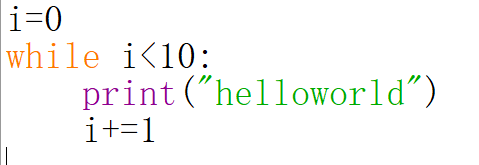{width="2.495138888888889in"
height="0.8597222222222223in"}

5.while-else结构：没什么用，只是能在跑完循环后出现这么一句话，可以用来判断循环是否完整跑完。

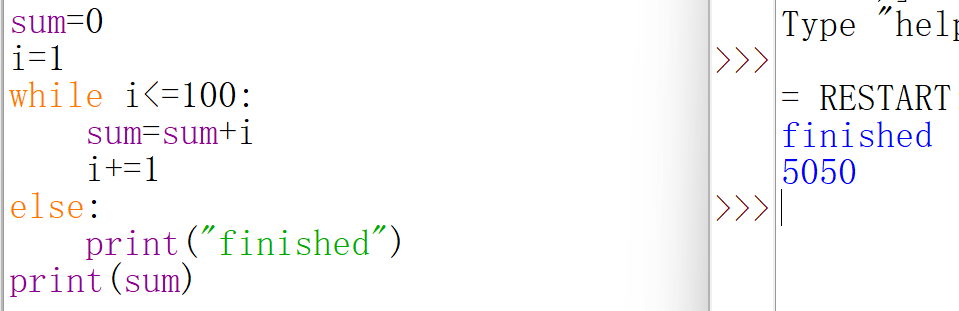{width="4.995138888888889in"
height="1.6201388888888888in"}

6.循环控制方法1：continue

Continue
用于结束当前本次循环，continue后面的内容不会得到进行，然后继续执行下一个循环。

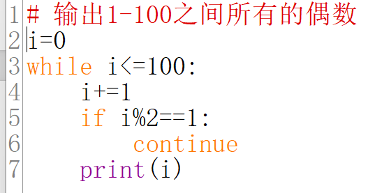{width="2.745138888888889in"
height="1.4430555555555555in"}

7.循环控制方法2：break：用来直接终止所在的循环

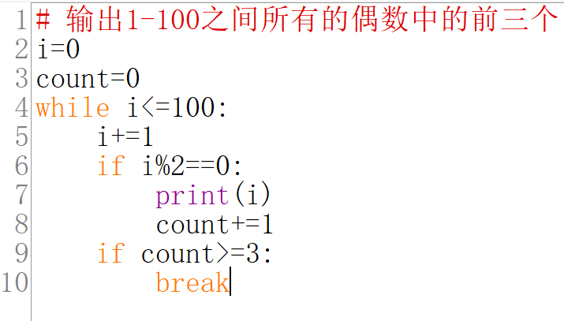{width="3.7243055555555555in"
height="2.120138888888889in"}

8.知识点补充：①无限循环不需要提前确定循环次数，不设定只不过会无限循环。

②：障眼法常错题：问：这个程序执行是否会进入死循环？

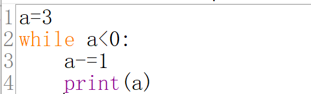{width="2.734722222222222in"
height="0.8284722222222223in"}

解答：由于a\>0会直接输出不过循环

③：两个辅助循环控制的保留字由此分别是：continue 和 break

# 三：try和ext函数

1.语句：

try:

\<语句块\>

except:

\<语句块\>

①常常用在于异常。异常不同于错误，它没有任何语法错误，但是在执行程序的过程中出现了问题（比如输入了不合法的变量等），这种错我们叫做异常。

例如：

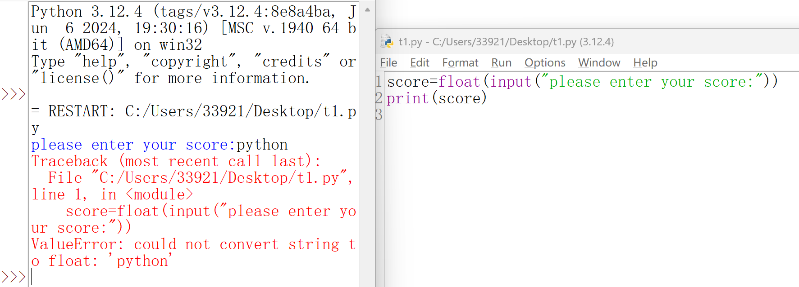{width="5.7625in"
height="2.0770833333333334in"}

②这时候我们常常会用try-except来使程序跳过错误。

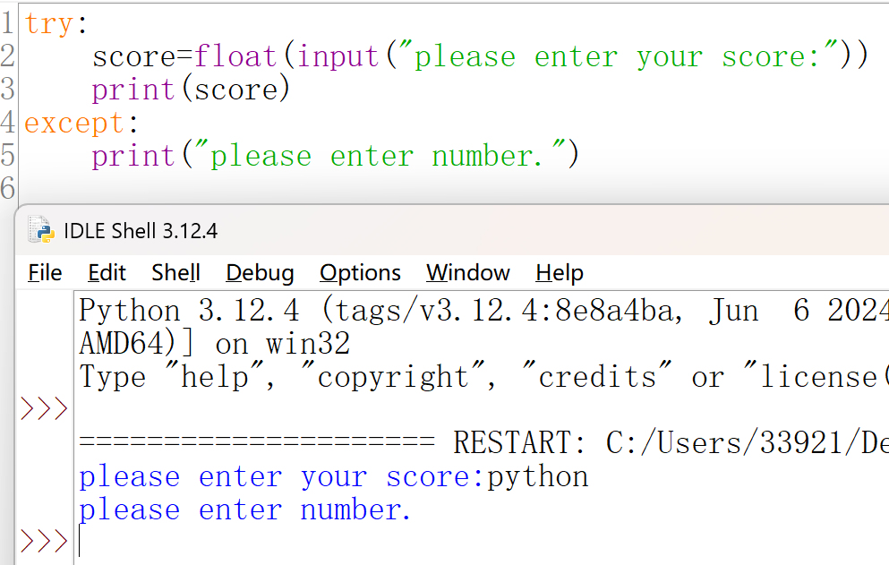{width="5.1722222222222225in"
height="3.2868055555555555in"}

③高级用法：except还可以加上特定异常类型反馈不同的语句：

Try:

\<program(pro)1\>

except \<异常类型\>:(如不能除以0：ZeroDivisionError)

\<pro2\>

except:

\<pro3\>

# 四：函数的定义与声明

1.基础知识：

①作用：降低变成难度；增加代码复用

def \<function name\>(\<parameter list\>):

\<function\>

return\<return num\>

②func函数可以设置有返回值，也可以没有返回值；参数列表中的参是形参。

③调用函数 直接写：func(\<parameter import\>)

④可以把返回值放到另一个变量里，如果不放就是原来的值。

⑤补充数据类型：tuple 元组 ，表示成： (4,3)

2.多个返回值

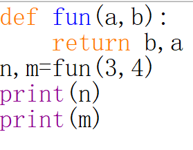{width="1.4534722222222223in"
height="1.1305555555555555in"}

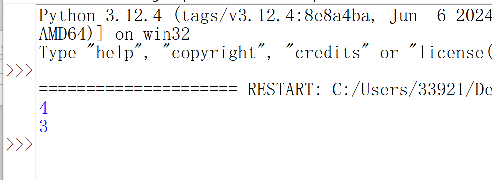{width="5.1409722222222225in"
height="1.8805555555555555in"}

3.知识点补充：①函数并不能提高代码的执行速度

②函数也可以没有return语句

4.实参与形参：函数的function name后面的参数集合 parameter
list里面的参数成为形参，是默认值，后面可以进行修改，修改的重新输入的参数叫实参。

5.可选函数：

def \<function
name\>(\<非可选参数列表\>,\<可选参数\>=\<默认值\>):

\<函数体\>

return \<返回值列表\>

这里强调函数名后面的参数列表顺序必须是先非可选参数列表也就是没有默认参数的变量，后面才可以是有默认参数的可选变量。

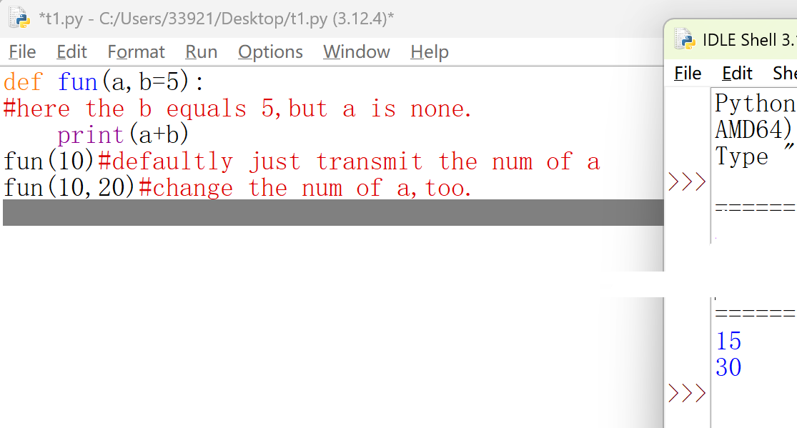{width="5.766666666666667in"
height="3.098611111111111in"}

6.函数的局部变量和全局变量

①局部变量：仅仅在函数内部有效，全局变量全局有效。

②全局变量在函数内部使用时，需要提前使用保留字
global的声明，才可以调用全局变量的参数值赋到所要参数内。

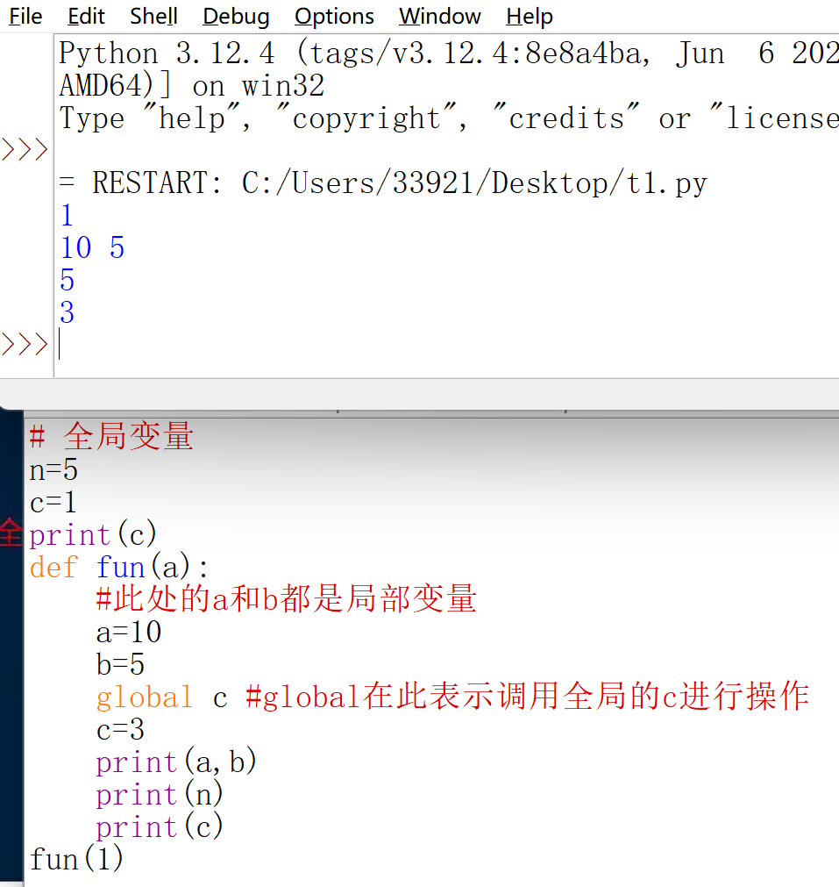{width="4.9847222222222225in"
height="5.2659722222222225in"}

7.函数输出不换行的方法：

print(\<the function to
print\>,end="\<\\n/
/etc\>")

# 五：字符串的操作与for循环

1.字符串的取出操作

运算符：+：字符串与字符串相连

\* 复制多次字符串

in 检验查询字符串是否在原字符串中

如：a in b 查询a是否在b ；里面若在，返回True，不在返回False

2.字符串的索引

\<字符串或字符串变量\>\[开始索引:结束索引:步长\]

注：①字符串中开始索引数为0，索引到结束索引数若为n，索引从要索引的第一位开始到n-1位

②步长为取每个步长长度内的字符串的第一个。

③负数时：

若步长为负数，则倒取

若只有一个负数，那取倒数的那个数字的那个字符

若是结束索引为负数，取到倒数第那个数字的那个字符。

3.for循环：遍历循环

结构：

for \<循环变量\> in \<可迭代对象\>:

\<循环体\>

①例题：

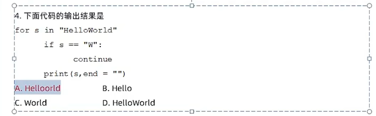{width="3.807638888888889in"
height="1.1826388888888888in"}

continue表示若遇到此情况，跳过本次循环，继续进入下一个循环。即遇到w跳过，并继续输出。

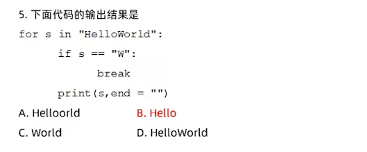{width="2.7555555555555555in"
height="1.1409722222222223in"}

而若是break，遇到时直接终止循环只输出hello。

[4.字符串常用函数]{.mark}

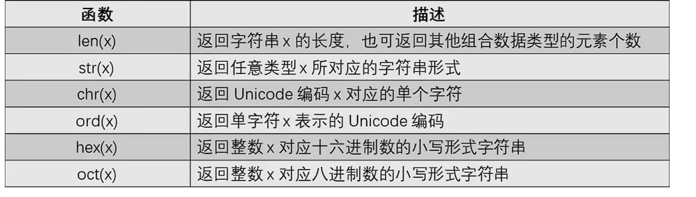{width="5.5159722222222225in"
height="1.5680555555555555in"}

len，str掌握，其他了解

[5.字符串常用处理方法]{.mark}

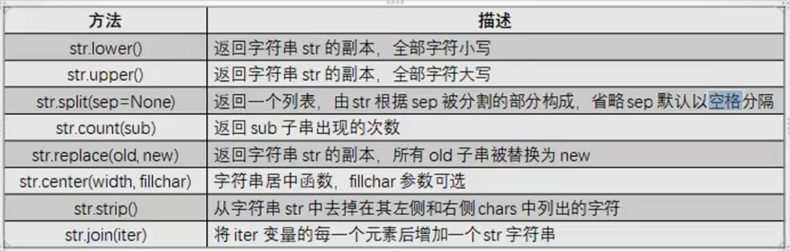{width="5.761111111111111in"
height="1.8354166666666667in"}

I:lower，upper大小写化

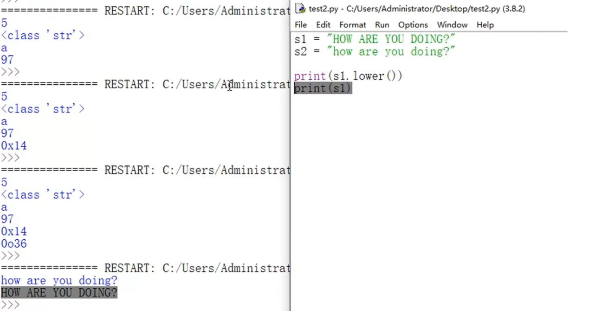{width="5.7659722222222225in"
height="3.0555555555555554in"}

处理结果如图所示。

[**II:split**可以基于你的参数里的分隔符，将变量拆开，拆成后形成一个列表。效果如图。]{.mark}

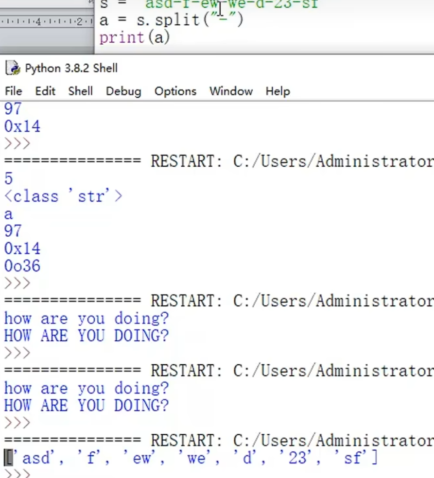{width="4.651388888888889in"
height="5.120138888888889in"}

**III:count**：看你规定的字符串在需求字符串里出现了几次

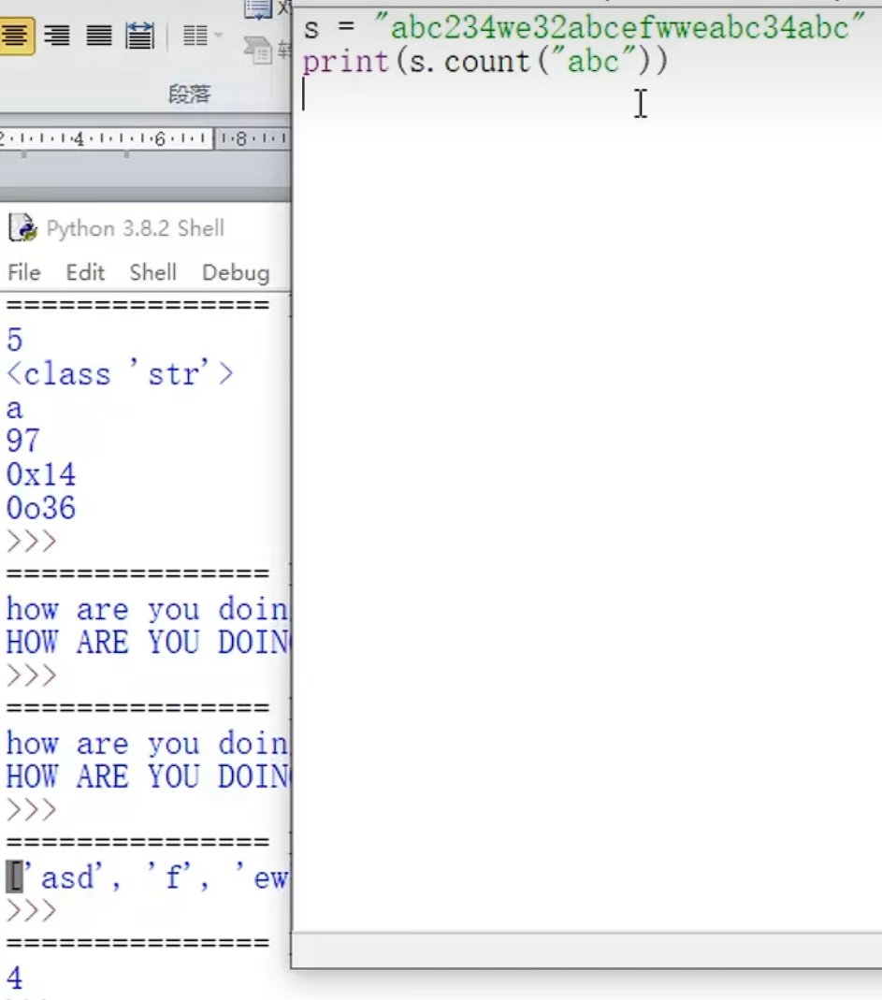{width="4.9118055555555555in"
height="5.5680555555555555in"}

[**IV:replace**：调换]{.mark}

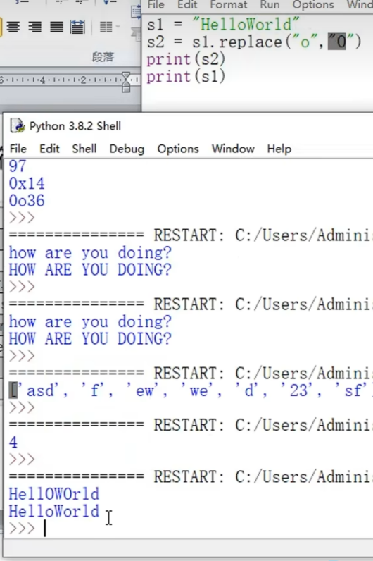{width="2.408333333333333in"
height="3.6180555555555554in"}

写在左边的是想要改变的，右边的是要替换成的，[替换一个字符串中的字母或数字为目标数字或字母。且保持原字符串不变。]{.mark}

[**V:center**：]{.mark}

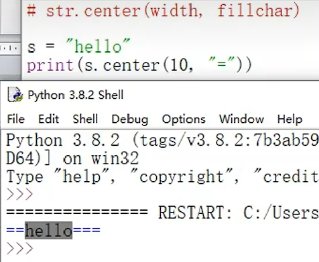{width="3.297222222222222in"
height="2.703472222222222in"}

居中化：调用str.center函数，第一个数代表我要多长的char，第二个char代表是我要用什么填充在左右尽力满足它在中间位置。（①系统默认先右后左填充，[②若没写fillchar默认是空格③若width\<char长度那么就返回原来的char）]{.mark}

[**VI:strip**（）：将char左右两边的指定符号给删去]{.mark}

[①默认str.strip()如果不加函数，那么就是str.strip(" ")]{.mark}

[②只看char的左右两边，若左右两边和输入的strip括号里的内容不同则这个char不会变动。]{.mark}

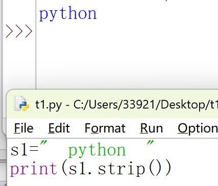{width="2.2243055555555555in"
height="1.9013888888888888in"}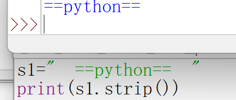{width="2.4118055555555555in"
height="1.0263888888888888in"}

**图一：做默认（默认是strip(" ")）**

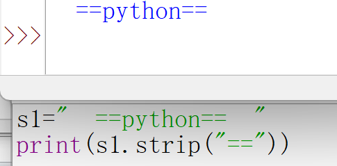{width="2.526388888888889in"
height="1.2451388888888888in"}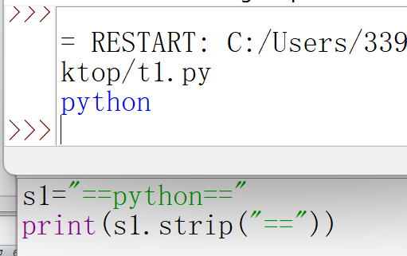{width="2.6618055555555555in"
height="1.6722222222222223in"}

**图二，在不一样时返回原来的样子。 图三：正确示例**

**[VII:join函数]{.mark}**

**[示例见图：]{.mark}**

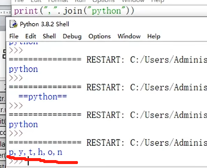{width="2.172222222222222in"
height="1.7659722222222223in"}

**VIII：capitialize()**

**见图：**

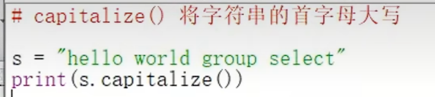{width="3.828472222222222in"
height="0.8597222222222223in"}

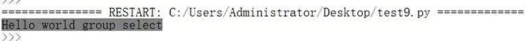{width="3.995138888888889in"
height="0.31805555555555554in"}

**IX：index/find**

**见图**

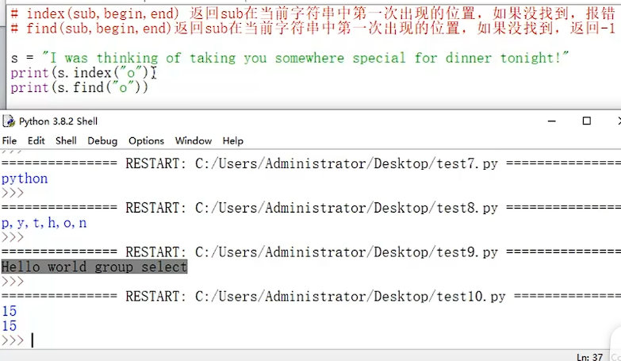{width="4.0784722222222225in"
height="2.370138888888889in"}

begin表示从第几位开始数；end表示到第几位（还是默认从0开始，到n-1位结束，begin是从第几个字母开始算上他自己【for也是这样算上他自己】。）

**X：习题：**

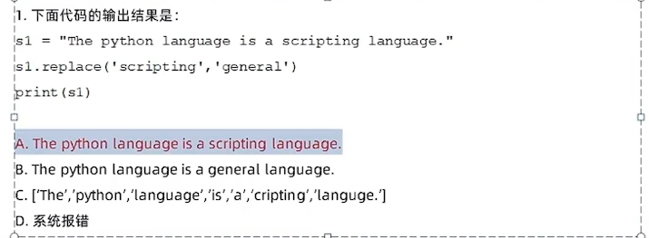{width="3.7243055555555555in"
height="1.3701388888888888in"}

[replace只是改变但并不返回，所以保持原样不变。]{.mark}

6.1.format格式化输出

①format的输入格式

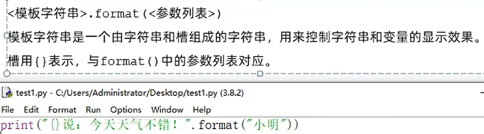{width="3.620138888888889in"
height="1.0055555555555555in"}

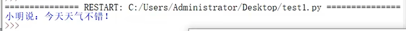{width="4.182638888888889in"
height="0.3284722222222222in"}

②输入进槽的顺序与用的format相同。

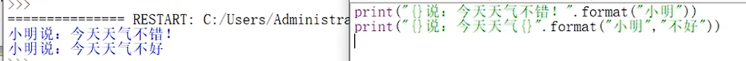{width="4.8597222222222225in"
height="0.4013888888888889in"}

③也可以给format强加顺序，与for循环的数字相同，0开始。不写序号必须标好序号（当你的format变量数小于槽数时）

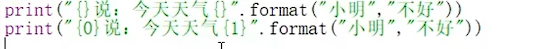{width="2.797222222222222in"
height="0.25555555555555554in"}

④format格式控制标志

[6.2]{.mark}

[格式为"{下面内容}".format(s)]{.mark}

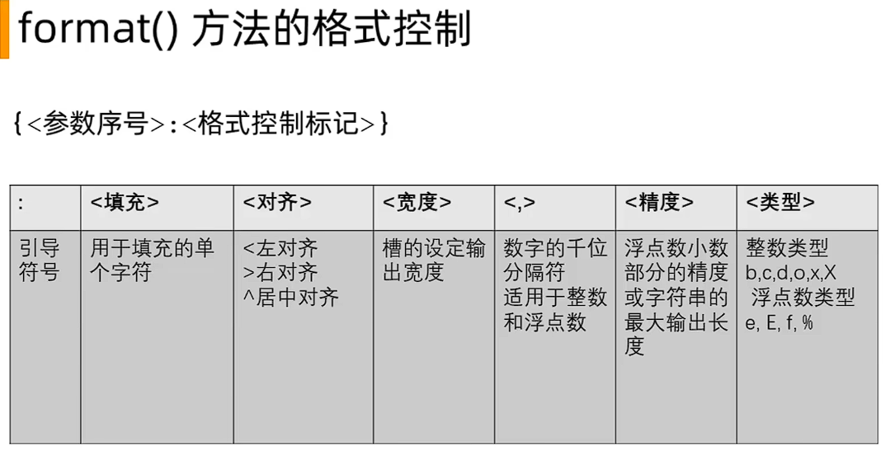{width="5.651388888888889in"
height="2.8493055555555555in"}

冒号前面加的数字为从第几个开始

[①如为填充成25个字符的字符串（冒号前面默认为开始位置）]{.mark}

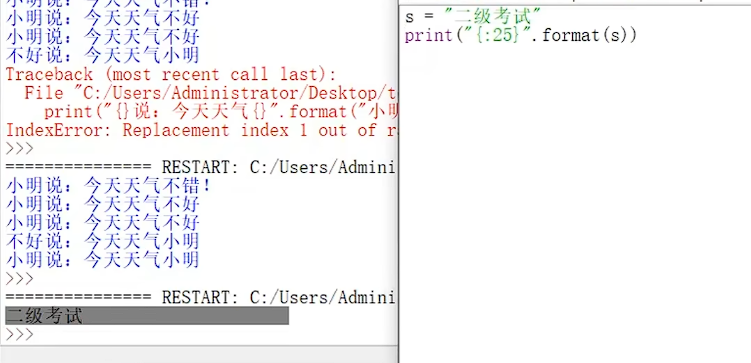{width="3.9118055555555555in"
height="1.8909722222222223in"}

[当然，当指定宽度\<变量宽度时，就原样输出。]{.mark}

[②\^符号的居中对齐]{.mark}

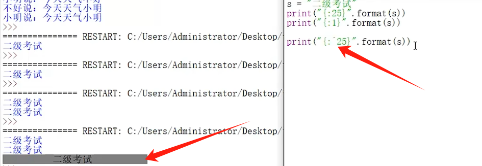{width="4.9222222222222225in"
height="1.7034722222222223in"}

[同时，此处注意，你要写的代码这个顺序应于表格表头的顺序一致。]{.mark}

[③填充内容：空格位置规定填充]{.mark}

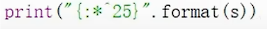{width="1.3909722222222223in"
height="0.15138888888888888in"}

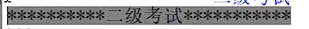{width="1.6097222222222223in"
height="0.15138888888888888in"}

④不同位置填充

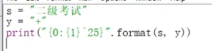{width="1.8597222222222223in"
height="0.4534722222222222in"}

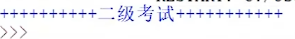{width="1.5368055555555555in"
height="0.20347222222222222in"}

[此处的1即为按顺序往下的填充空，]{.mark}从0位置开始计算的，填充y如同6.1，填充结果如上[图]{.mark}

[⑤]{.mark}

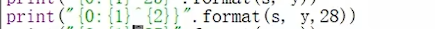{width="2.265972222222222in"
height="0.15138888888888888in"}

[此处的2指的是填充的是按顺序的：填充、对齐、宽度，轮到宽度，宽度看最右边括号定义为28]{.mark}

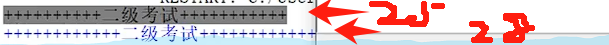{width="3.172222222222222in"
height="0.23472222222222222in"}

[⑥逗号分隔符，分割3位一次]{.mark}

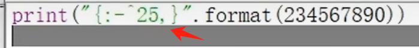{width="3.640972222222222in"
height="0.4222222222222222in"}

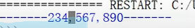{width="1.4430555555555555in"
height="0.21388888888888888in"}

5-4-3精度起补充

# 六：组合数据类型

**1.组合数据类型分为三类：**

集合类型：集合

序列类型：列表、元组、字符串

映射类型：字典

**2.1集合类型-set：**

·python里集合类型与数学中的集合概念一致

·集合用来储蓄无序且不重复的数据

·集合中元素的类型只能是不可变数据类型，如：整数、浮点数、字符串、元组等。

·相比较而言，列表、字典和集合类型本身都是可变数据类型。

例1：

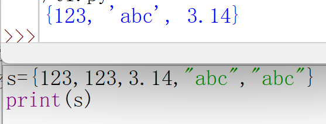{width="2.901388888888889in"
height="1.1097222222222223in"}

无序：存放的顺序和往里面输入的顺序不太一样。

不重复：只有一个显示，虽然放了好多个。

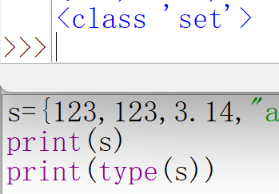{width="1.8180555555555555in"
height="1.2659722222222223in"}集合的数据类型：set

2.2集合的操作符

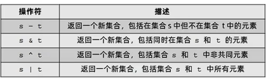{width="4.230555555555555in"
height="1.257638888888889in"}

&交集、\|并集

2.3集合中常用的操作函数与方法

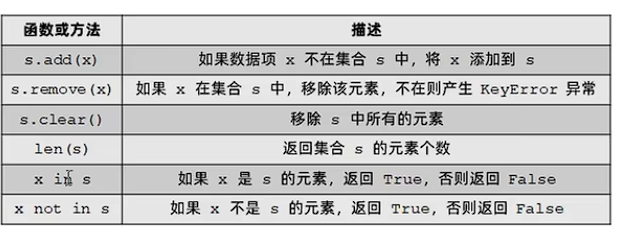{width="4.511111111111111in"
height="1.6854166666666666in"}

输入:若集合是s

s.clear()

print(s)

输出：set()
这是一个空集合的表示方法在python中。

易错点：不能创造空集合的方法

s={}

print(s)

输出：{}
但当我们查询它的性质的时候，发现为dict，不是set！

那可以怎么创建空集合呢？

①.用clear

②.s=set()或者是set({})就可以

**3.序列类型：**

3.1.序列类型用来存储有顺序并且可以重复的数据，分别为以下两种类型：

列表(list)

元组(tuple)

3.2.1列表用\[\]创建和定义：

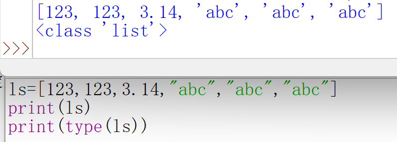{width="4.151388888888889in"
height="1.4847222222222223in"}

3.2.2.列表的索引：

·索引用来寻找列表中元素的位置（原理同字符串索引相同）

3.3列表中可以放列表的元素

ls=\[123,123,"abc","abc",3.14,\[1,14\],\[3.11,0.1\]\]

那我要取【1,14】中的14怎么写：

print(ls\[5\]\[1\])：二次切片

3.4列表类型-常用的操作符和函数

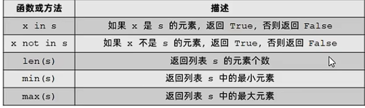{width="4.19375in"
height="1.2486111111111111in"}

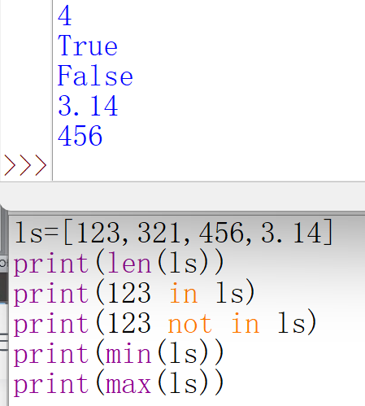{width="2.338888888888889in"
height="2.5993055555555555in"}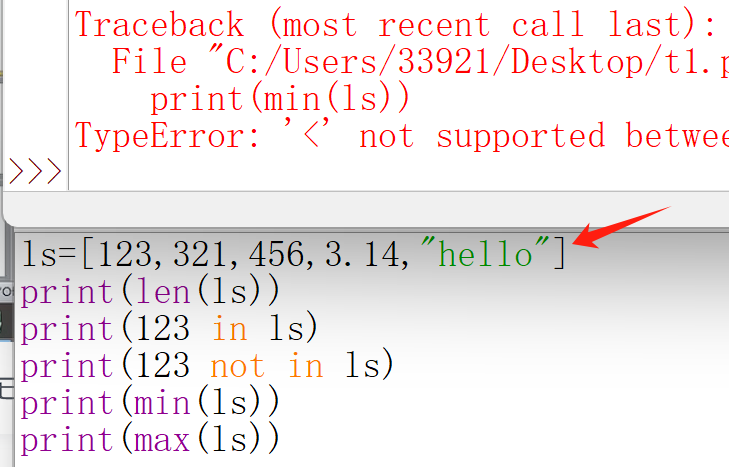{width="3.797222222222222in"
height="2.432638888888889in"}

当有char时报错。

3.4.2那如果全是字符串，该怎么比较呢？

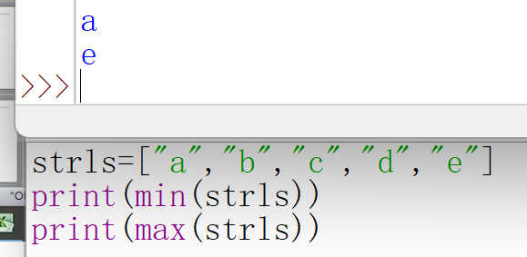{width="3.015972222222222in"
height="1.4743055555555555in"}

如果都是英文字母字符串时按字母来排序

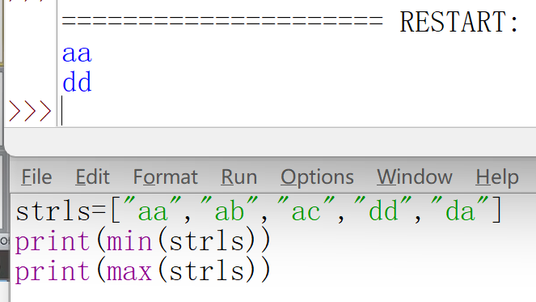{width="3.453472222222222in"
height="1.9430555555555555in"}

首字母若相同再看第二个字母，若相同（有两个aa）也返回aa

[3.5列表类型-常用操作方法：]{.mark}

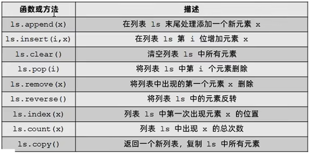{width="4.815972222222222in"
height="2.38125in"}

[①pop不加参数默认删除最后一个元素]{.mark}

②reverse函数：如果什么都不写那就是把列表中的元素全部倒过来。

[③可以根据索引来修改值]{.mark}

[b\[0\]=......来进行修改b中第一个元素值]{.mark}

3.6创建一个空列表:

①ls=\[\]

②ls=list()

③ls=list(\[\])

**4.元组（tumple）**

·元组一旦被定义就不能修改

·元组类型使用()来表示，例：

t=(123,3.14,123,"abc")

[元组的索引和切片与列表一致：]{.mark}

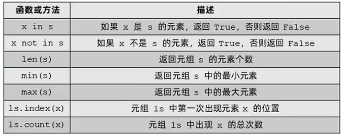{width="4.45in"
height="1.7791666666666666in"}

**5.for循环与列表元组**

ls=\[123,234,"abc"\]

for i in ls :

print(i)

把ls里面的每一个拿出来显示一遍。

**6.字典**

6.1字典的定义：

·字典类型数据主要以"键值对"的形式存储，类似汉语字典的目录形式。

·定义格式如下：（数据类型是dict）

{\<key1\>:\<value1\>,\<key2\>:\<value2\>,...,\<key n\>:\<value n\>}

6.2字典的索引：dict\[索引\]

索引：是输入键

# 七：文件的操作

1\.

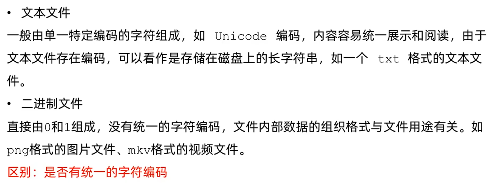{width="5.7625in"
height="2.1569444444444446in"}

文本文件-文件打开是一堆文字

二进制文件：没有文字

**文本方式打开时，读写按照字符串方式**

**二进制文件打开时，读写按照字节流的方式**

2.文件操作：打开文件

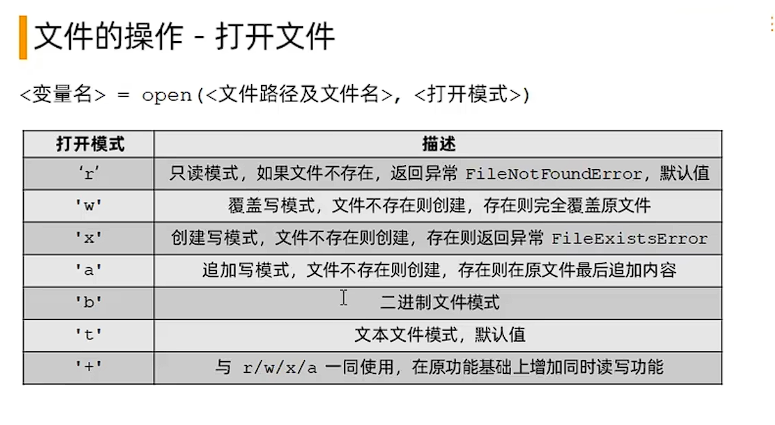{width="4.0368055555555555in"
height="2.213888888888889in"}

剩下的rb，rt直接写就可以

如果没有输入b读取二进制，则统一默认先读取的是文本文件格式。

3.文件的读取

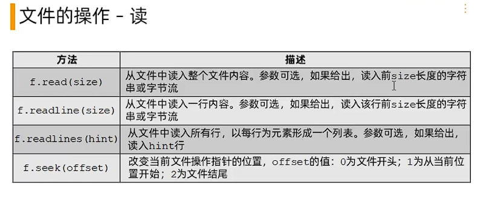{width="4.120138888888889in"
height="1.7138888888888888in"}

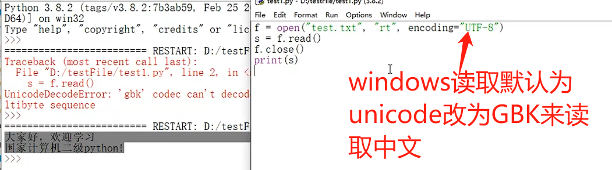{width="5.4743055555555555in"
height="1.5263888888888888in"}

注意：此处要这样直接读取需要保证读取文件与python文件（.py）处于同一个目录下。

那如果我放在不同的路径下呢？比如放到了文件夹a里：

输入好路径"a/文件名"即可。

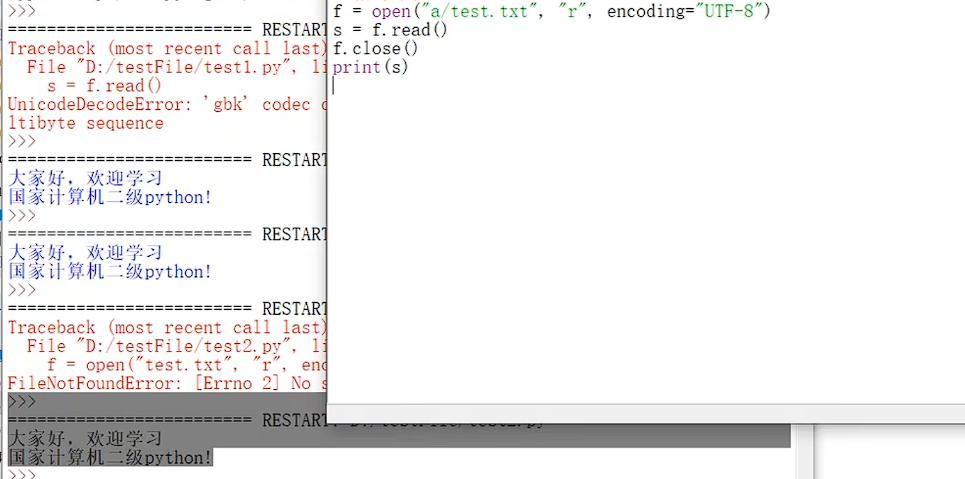{width="5.026388888888889in"
height="2.495138888888889in"}

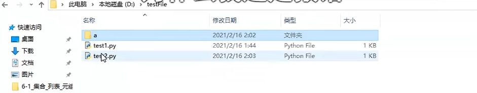{width="4.901388888888889in"
height="0.9638888888888889in"}

4.相对路径与绝对路径

相对路径是指与py在同一个文件夹下的路径。

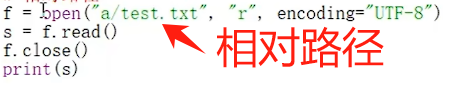{width="2.390972222222222in"
height="0.4534722222222222in"}

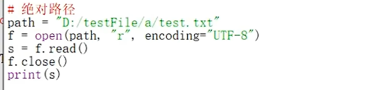{width="2.734722222222222in"
height="0.6722222222222223in"}（完整的路径）

注意：

路径分隔符要运用/，不能用\\。

在python中\\意为转义字符：

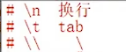{width="0.7451388888888889in"
height="0.3076388888888889in"}

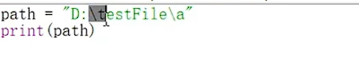{width="2.088888888888889in"
height="0.47430555555555554in"}

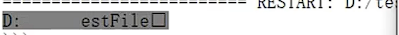{width="2.078472222222222in"
height="0.18263888888888888in"}

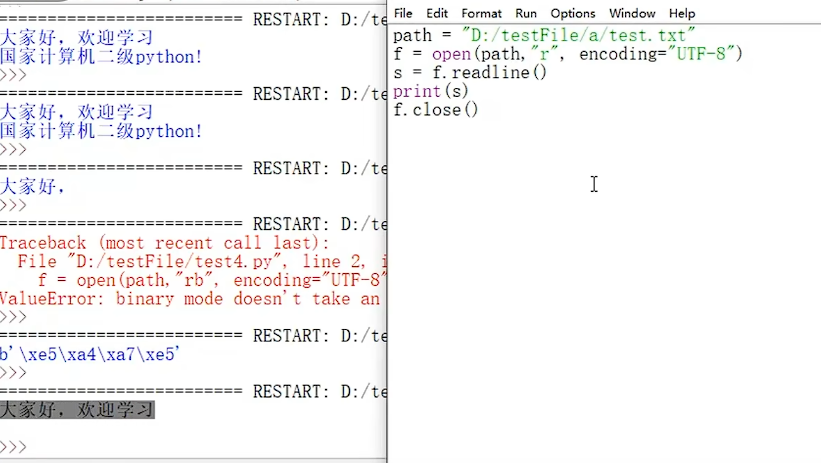{width="4.276388888888889in"
height="2.4118055555555555in"}

①readline是读取某一行，如果不写参数则默认为第一行所有。

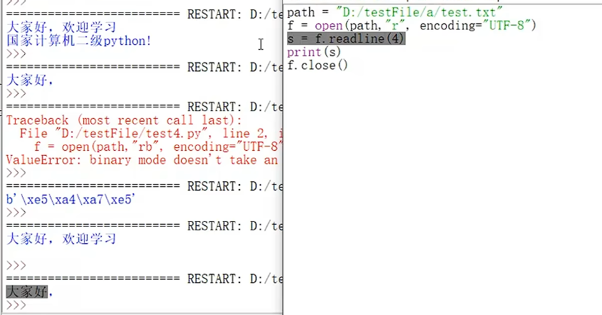{width="4.401388888888889in"
height="2.307638888888889in"}

②规定好数字的话，读的是第一行的那几个数字。

③若多次调用readline函数，则指针（pyhton里的光标）依次按序读取不同行

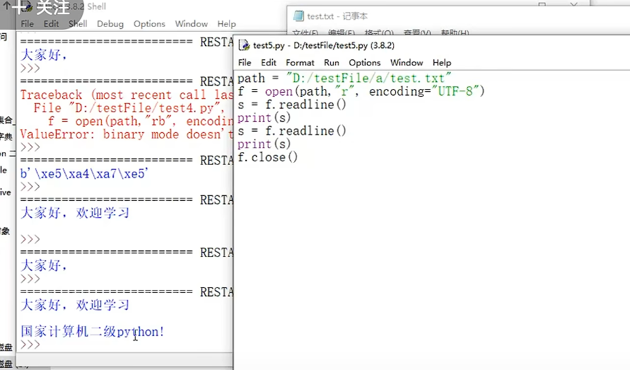{width="4.6409722222222225in"
height="2.7243055555555555in"}

多出来的切行是因为print自带换行。（或可以解释为输入的txt文本每一行（除最后一行外）都默认携带\\n换行符被隐藏。）

④

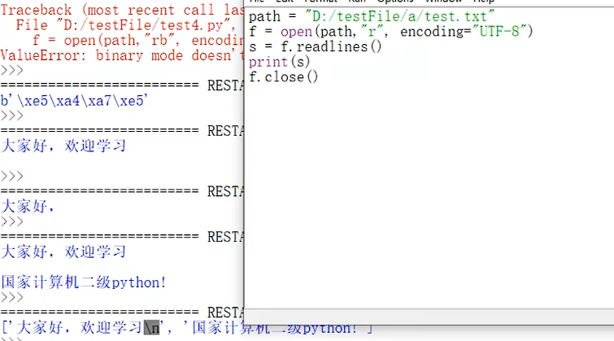{width="3.932638888888889in"
height="2.182638888888889in"}

使用readlines捕捉到\\n换行符，同时输出为列表，不同元素有"，"隔开，不同元素来自不同行。

⑤seek的运用

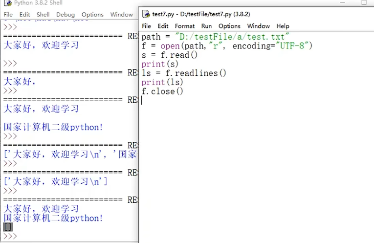{width="3.984722222222222in"
height="2.588888888888889in"}

当你读入两次时，发现第二次只能读入空的，这是为什么呢？

这是因为，指针负责读取这套文字的，已经跑完了全程在第一次代码之中，第二次代码并没有相应的内容可以读取，于是输出的是空。

此时要想输出，可以通过seek函数改变指针位置再输出。

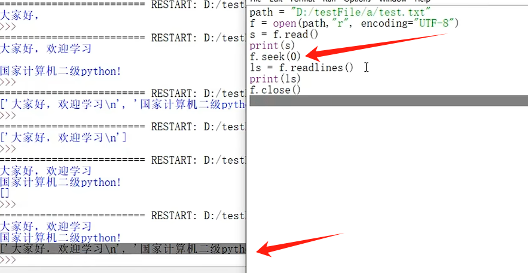{width="4.5993055555555555in"
height="2.3805555555555555in"}

我们通过seek函数让指针回到开头，便可以得到相应的列表。

4.文件的撰写：

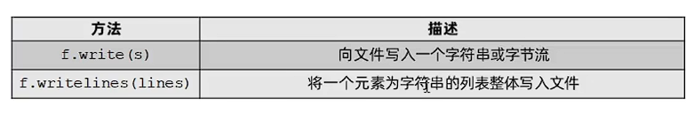{width="4.0680555555555555in"
height="0.7138888888888889in"}

①write：

目前我们的文件夹中是没有这个文件，new.txt的，我们下面通过代码来试试看。

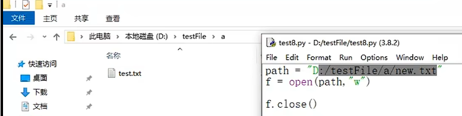{width="3.984722222222222in"
height="1.0055555555555555in"}

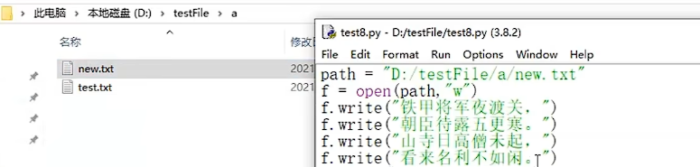{width="4.0368055555555555in"
height="0.9638888888888889in"}

代码运行结果

②writelines的应用

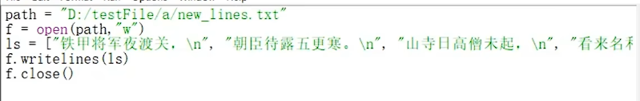{width="4.1618055555555555in"
height="0.6618055555555555in"}

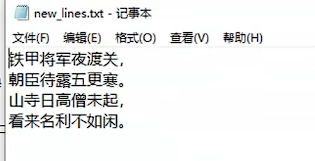{width="1.6409722222222223in"
height="0.8388888888888889in"}

③ write与追加写模式a结合：

原内容：

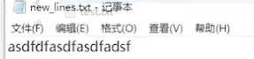{width="1.4951388888888888in"
height="0.34930555555555554in"}

代码：

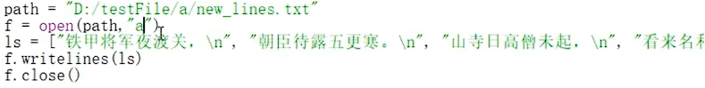{width="4.1097222222222225in"
height="0.5159722222222223in"}

结果：

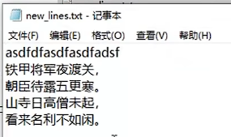{width="1.4847222222222223in"
height="0.8805555555555555in"}

5.文件读写操作练习题

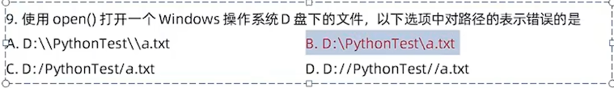{width="3.953472222222222in"
height="0.5680555555555555in"}

6.一维数据的读写

①一维数据和二维数据的区别与本性

1.一行数据就叫做：一位数据

2.有行有列的这种数据就叫做二维数据，如图。

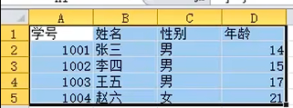{width="1.6722222222222223in"
height="0.6201388888888889in"}

②一维数据详解：

1.什么是一位数据：就是一行数据，用不同的符号分割。

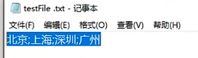{width="1.5055555555555555in"
height="0.44305555555555554in"}

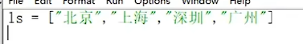{width="1.9638888888888888in"
height="0.28680555555555554in"}

注：像这种用逗号分隔的存储形式，我们通常有一种专门的文件，叫csv文件。如图：

将csv文件不用默认的excle用txt打开，为逗号分隔开的。

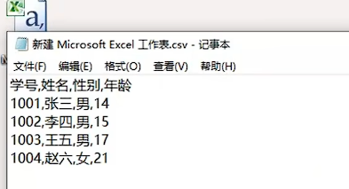{width="2.047222222222222in"
height="1.1097222222222223in"}

2.一维数据csv的写入

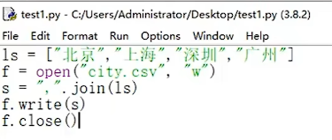{width="1.9534722222222223in"
height="0.8284722222222223in"}

注：此处利用join函数，将列表里的不同元素用逗号分隔开，同时还可以将列表（或元组）中的字符串连接成一个字符串，非常的强大。

读取结果：

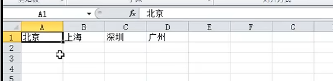{width="2.922222222222222in"
height="0.7138888888888889in"}

3.从文件中把内容读取出：

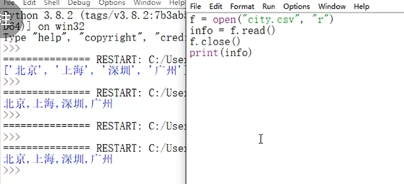{width="3.5368055555555555in"
height="1.6097222222222223in"}

直接取出，获得字符串。

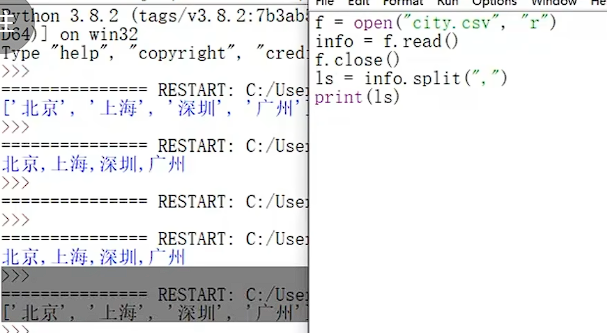{width="3.1618055555555555in"
height="1.7347222222222223in"}

运用.split函数，将取出的内容，通过要求的逗号来作为分隔符，分隔开并按一个个元素放到一个列表中。

7.二维数据的读写

①利用嵌套列表构建一个二维数据

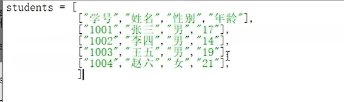{width="2.953472222222222in"
height="0.8805555555555555in"}

②红色箭头所指为第一次提取数据，提取的是不同列表

蓝色箭头表示嵌套提取，提取提取的不同列表的内容即所有的元素。

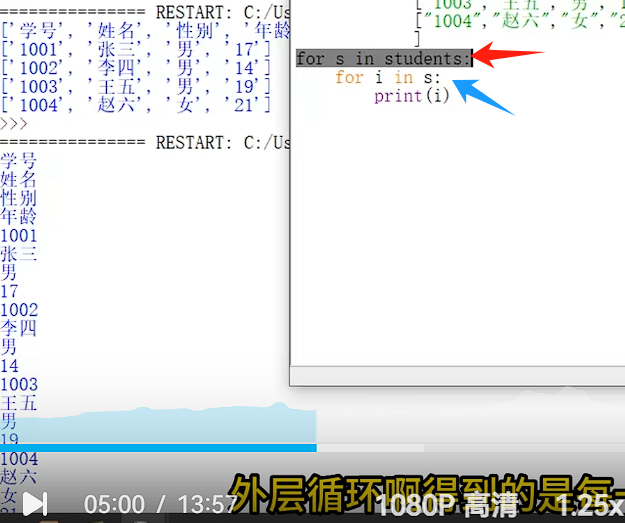{width="3.2555555555555555in"
height="2.7243055555555555in"}

③写入数据

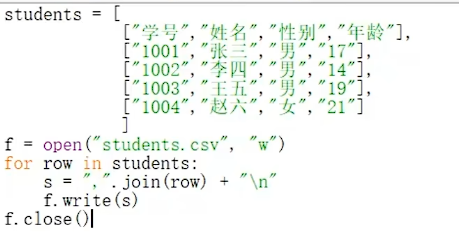{width="2.390972222222222in"
height="1.2659722222222223in"}

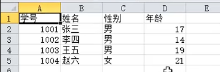{width="1.9326388888888888in"
height="0.6305555555555555in"}

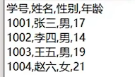{width="0.9951388888888889in"
height="0.5680555555555555in"}

④读出数据

拿到不同的列表

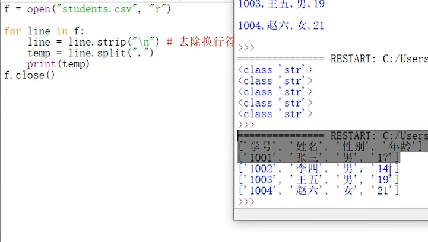{width="3.7555555555555555in"
height="2.1305555555555555in"}

拿到一个最初的student的类似二维数据（列表嵌套列表）

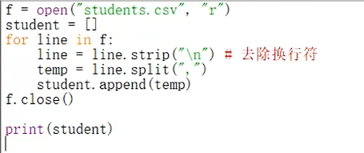{width="2.370138888888889in"
height="0.9951388888888889in"}

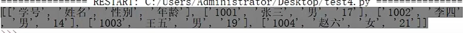{width="4.088888888888889in"
height="0.2972222222222222in"}

3.习题

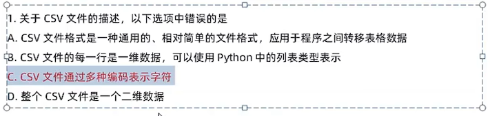{width="3.703472222222222in"
height="0.8805555555555555in"}

一种文件只能有一种编码形式。

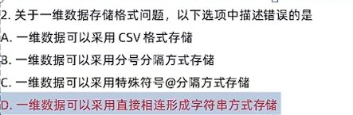{width="2.307638888888889in"
height="0.7555555555555555in"}

# 八：内置函数调用

## 1.模块引用

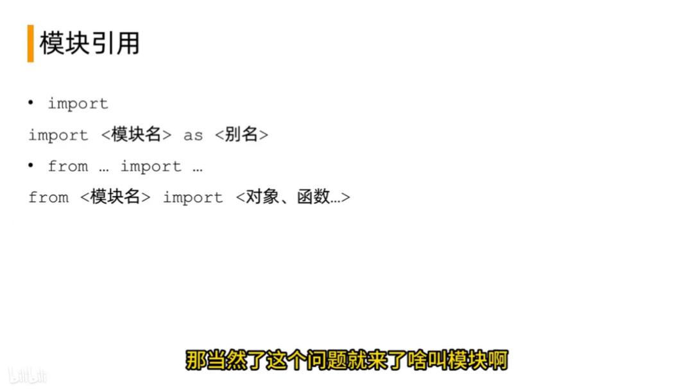{width="4.9743055555555555in"
height="2.334722222222222in"}

注：模块就是你要调用的函数库（一般是写好的py文件）。模块名自然也就是你编写函数的py文件的名字。别名是可以定义多个名字，也可以你自己给它起的时候用。

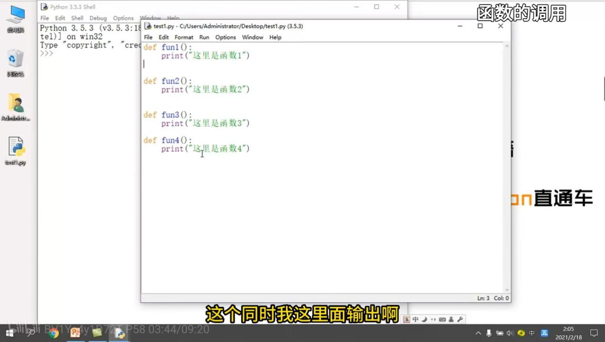{width="4.820833333333334in"
height="2.8819444444444446in"}

①比如我现在想写一个函数库，比如是个py文件，命名为test1，具体函数内容如图所示。

②那我该如何在另外一个py文件调用这个函数呢？利用import指令。

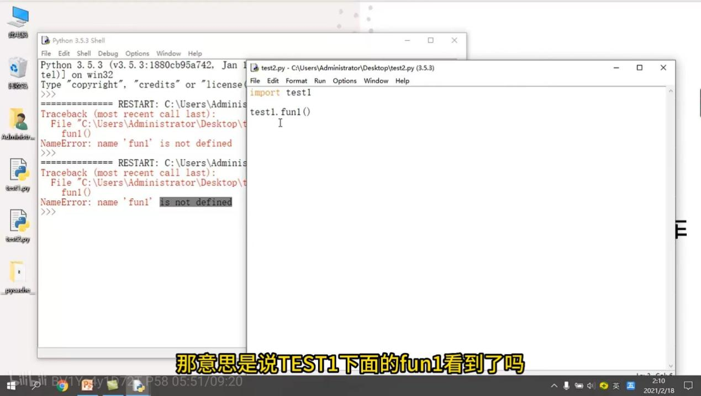{width="3.890972222222222in"
height="2.547222222222222in"}

import就是调用，调用test1里面的函数

但注意的是：当你调用库后调用函数时，不能直接写fun1()，因为系统找不到在这个文件中的fun1（），因此你要写完整的，test1.fun1()表示调用test1文件里的fun1函数。

③可以给函数写一个别名，这里注释了别名t，如果这个test1没有别名，则默认创建一个别名t，后面调用可以直接写：t.fun1()

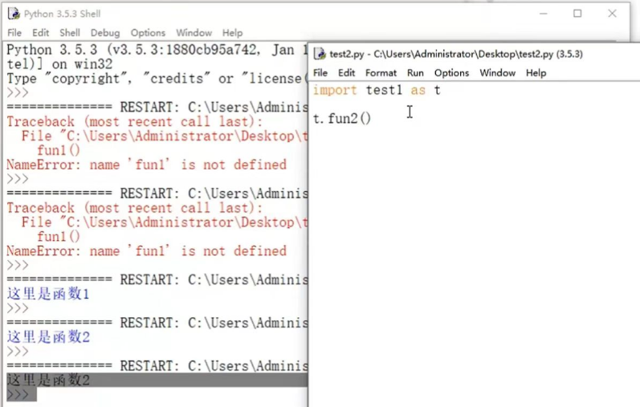{width="4.151388888888889in"
height="2.640972222222222in"}

④调用一个库中的多个函数顺着写即可，但都要注意在开始要声明调用，如箭头所指

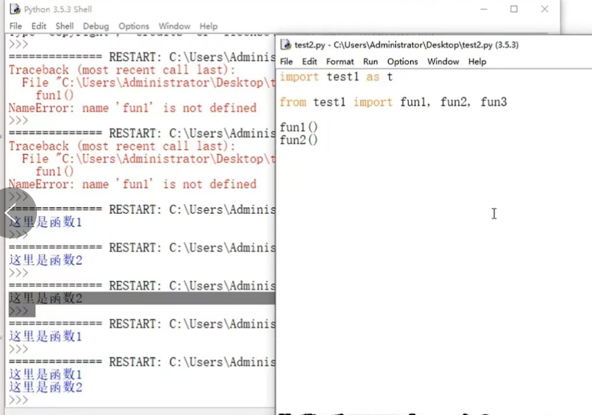{width="4.338888888888889in"
height="3.047222222222222in"}

同时这里还运用了另一个调用函数，from...import...,具体用法见前①图片。

⑤那如果我要调用的库里面的函数太多怎么办？

用\*调用所有：

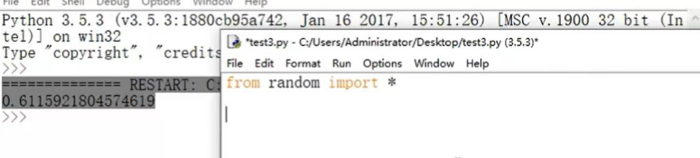{width="4.0368055555555555in"
height="0.9118055555555555in"}

⑥补充：python的标准库指的是python默认提供的库（里面包含了默认的写好的函数）

## 2.内置函数

2.1部分内置函数

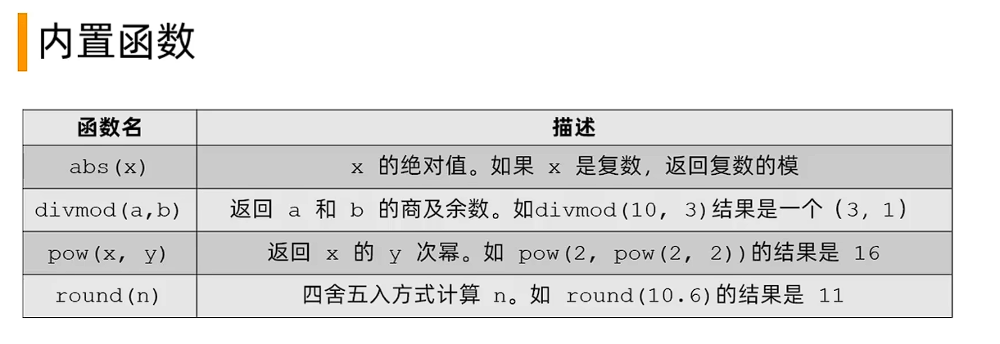{width="5.761805555555555in"
height="1.9868055555555555in"}

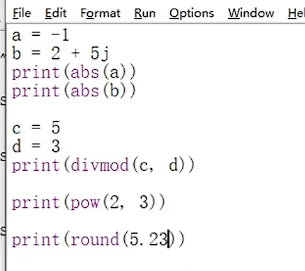{width="1.5888888888888888in"
height="1.4118055555555555in"}

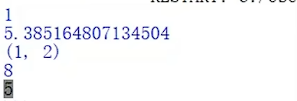{width="1.5472222222222223in"
height="0.5263888888888889in"}

注：其中round函数也可以写成：

round(a,b)，a为具体的数，b为保留到第几位小数。

2.2部分内置函数

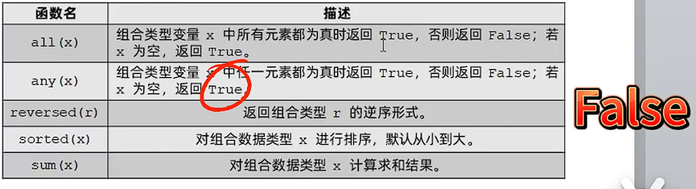{width="4.5055555555555555in"
height="1.2243055555555555in"}

注：使用all/any时，在python中任意一个数除了0之外转化为布尔数值都是True，只有0是False。

当你输入的是str类型时，也默认转化为布尔值True

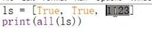{width="1.3388888888888888in"
height="0.34930555555555554in"}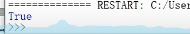{width="1.6305555555555555in"
height="0.2972222222222222in"}

2.3部分内置函数

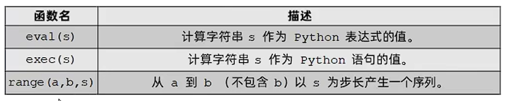{width="3.7555555555555555in"
height="0.7451388888888889in"}

①eval函数可以把一个字符串左右两边的双引号或者单引号去掉。

例1：

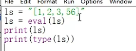{width="1.4534722222222223in"
height="0.5472222222222223in"}

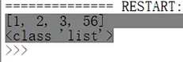{width="1.2034722222222223in"
height="0.41180555555555554in"}

例2：

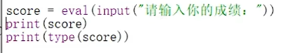{width="2.182638888888889in"
height="0.3909722222222222in"}，输入的内容是带引号的str，去掉就成了数

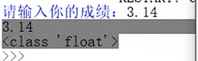{width="1.2972222222222223in"
height="0.4013888888888889in"}

②exec函数

把语句两边的引号去掉，并且能够让他形成一个python真正认识的一个语句，还能给他执行掉

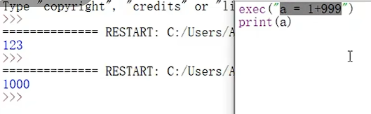{width="2.7555555555555555in"
height="0.8493055555555555in"}

## 3.turtle函数

①整体turtle函数详细函数概览

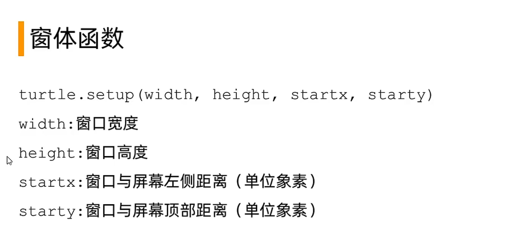{width="5.4430555555555555in"
height="2.463888888888889in"}

设置画布大小

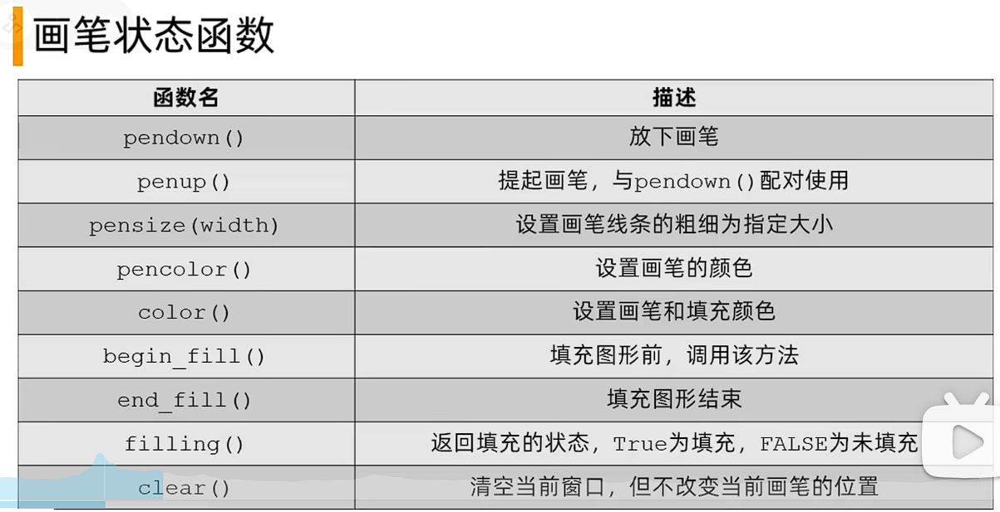{width="5.764583333333333in"
height="2.9569444444444444in"}

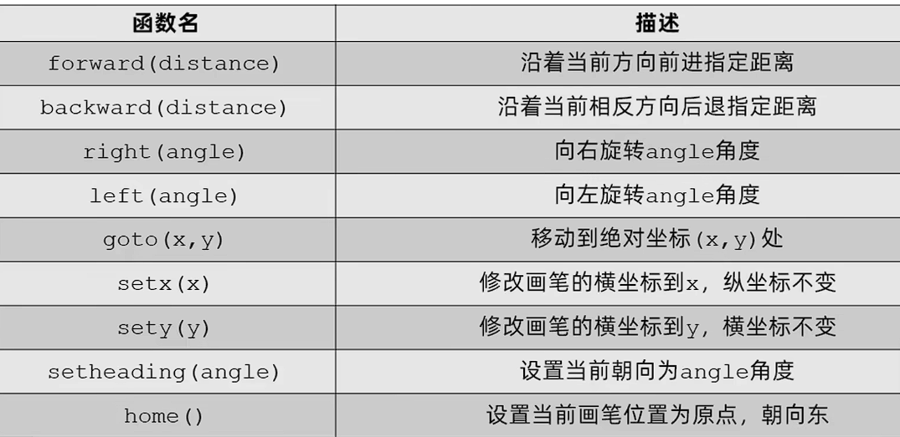{width="5.5993055555555555in"
height="2.7243055555555555in"}

②常见函数讲解

1.窗体函数不多赘述

2.forward函数:前进后退

forward(distance)/fd(distance)

backward(distance)/bk(distance)

3.转向：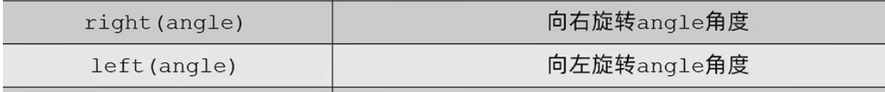{width="5.761805555555555in"
height="0.6013888888888889in"}

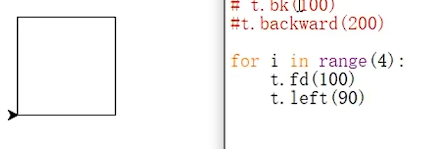{width="2.307638888888889in"
height="0.7763888888888889in"}

循环四次绘制正方形（range（4）意为循环了4次）

4.pensize()：笔的粗细=width()也是笔的粗细

5.pencolor画笔的颜色

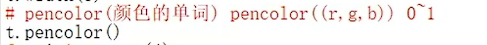{width="2.5368055555555555in"
height="0.23472222222222222in"}

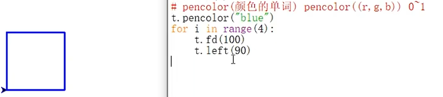{width="3.901388888888889in"
height="0.8597222222222223in"}

注意：必须先设颜色再画图才能用到不同颜色的图形！

6.填充颜色：

①t.color(,)，第一个参数是画笔颜色，第二个参数是填充颜色

②但是必须还要执行填充命令才可以填充！

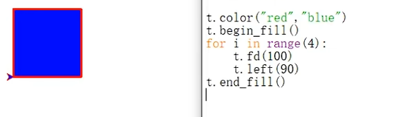{width="2.984722222222222in"
height="0.8805555555555555in"}

7.filling，clear基本不考

8\.

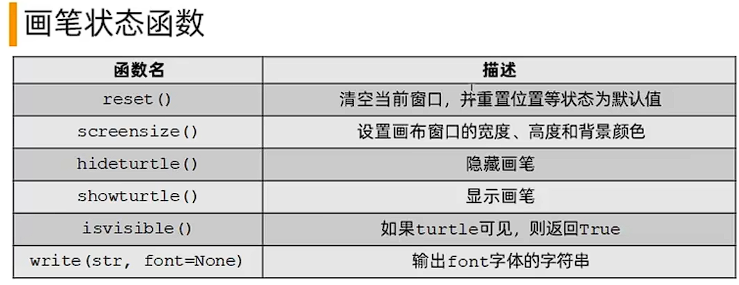{width="3.8493055555555555in"
height="1.4847222222222223in"}

①其中，screensize不考，invisible基本不考；

②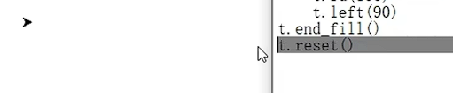{width="2.6618055555555555in"
height="0.5472222222222223in"}

reset的清除

③hideturtle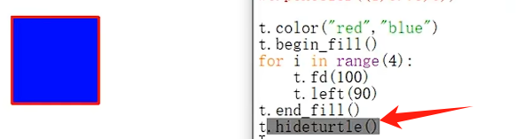{width="3.078472222222222in"
height="0.8180555555555555in"}

④write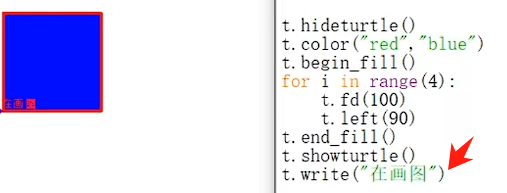{width="2.640972222222222in"
height="1.0055555555555555in"}

9.penup/pendown

意为：画笔抬起/画笔落下

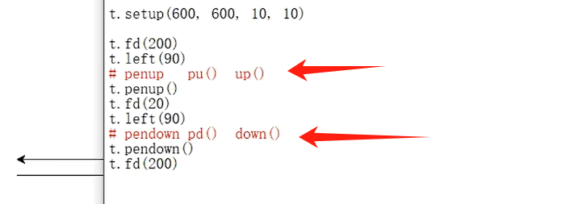{width="3.703472222222222in"
height="1.3180555555555555in"}

画平行线的步骤：

第一步setup规定画布；

向前200，左转90°，提笔不接着画，前进20；

左转90度，落笔，再画画出一对平行线。

其中红色箭头所指：penup可以简写成pu(),up()；pendown可简写成pd(),down()。

10.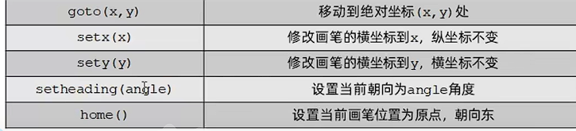{width="3.776388888888889in"
height="0.8597222222222223in"}

其中setheading是设置绝对方向。

比如开始默认是朝右的，为0度，你如果设为90，那开头的时候乌龟脑袋默认朝上，后面所有的转弯命令基于这个方向改变。

11\.

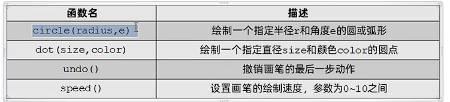{width="3.9118055555555555in"
height="0.8909722222222223in"}

（1）①其中circle的绘制园（弧）是按照逆时针方向绘制的（输入circle(60)）；想让他顺时针画只要改成"circle(-60)"即可

②同时这个角度也是按照逆时针来算的；同理改成-360的第二个参数的话，就顺时针画了。

③这里的circle还省略了一个参数叫：step。circle(60,step=3)意思为在这个r=60的半径的圆中画一个三角形，step=6就是六边形

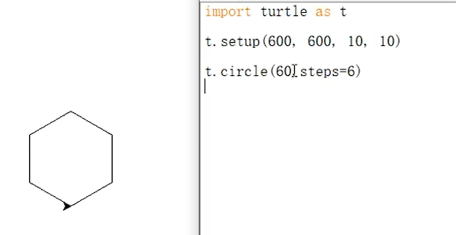{width="2.932638888888889in"
height="1.5159722222222223in"}

但是没有 那个圆了！

（2）speed调整绘画速度。

"10"是瞬间完成。

12.goto是移动到哪一个坐标

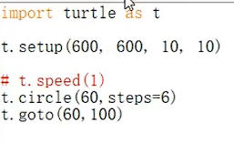{width="1.3388888888888888in"
height="0.8180555555555555in"}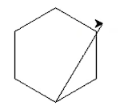{width="0.8076388888888889in"
height="0.7138888888888889in"}

13.setheading=set

可以直接用t.set来调用

undo不考

14.dot

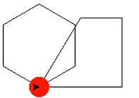{width="1.0263888888888888in"
height="0.7243055555555555in"}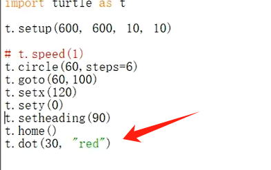{width="2.047222222222222in"
height="1.2868055555555555in"}

## 4.random库

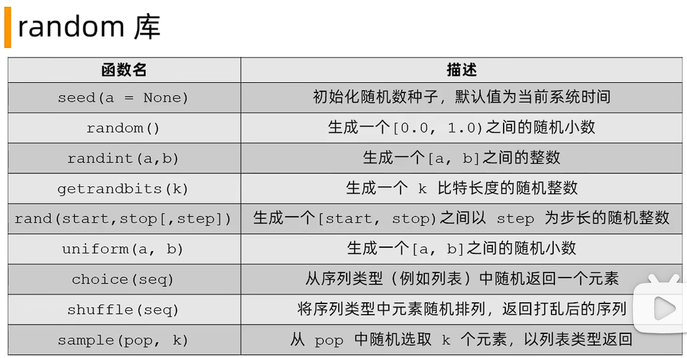{width="5.763888888888889in"
height="3.004861111111111in"}

randrange

1.random()

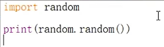{width="1.4326388888888888in"
height="0.41180555555555554in"}

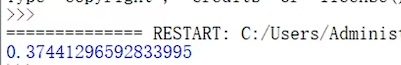{width="2.088888888888889in"
height="0.3388888888888889in"}

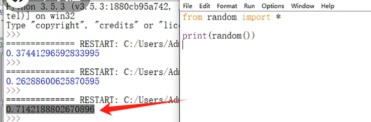{width="3.8493055555555555in"
height="1.2659722222222223in"}

2.常考的函数：random;randint;seed;uniform

3.shuffle

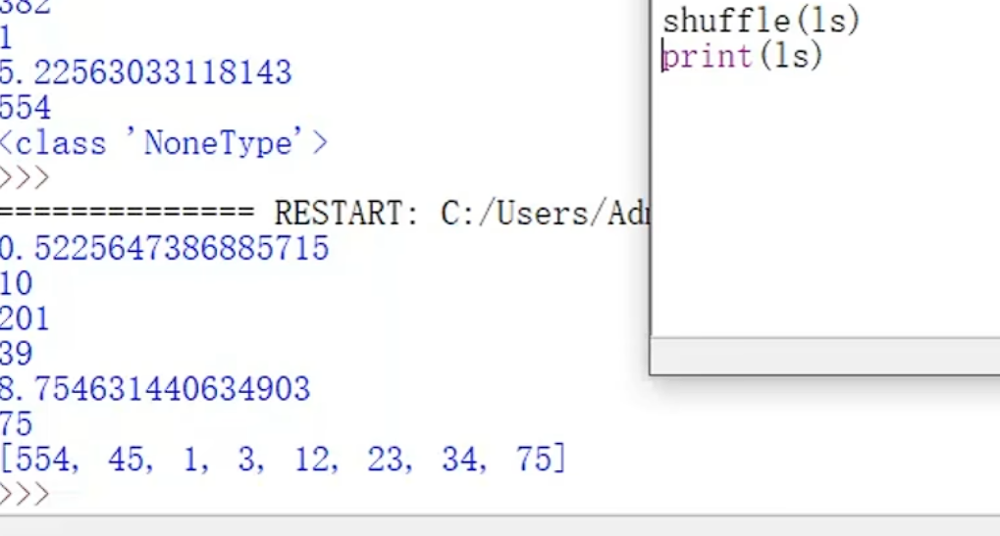{width="5.307638888888889in"
height="2.8493055555555555in"}

调用shuffle打乱并返回至原值

我们再调取。

4.randrange，比如 randrange(0,100,2)

意思是从0到99中以步长为2，即0,2,4,6，......中挑一个数。

# 九：第三方库

1.其他的第三方库

网络爬虫的库名记忆

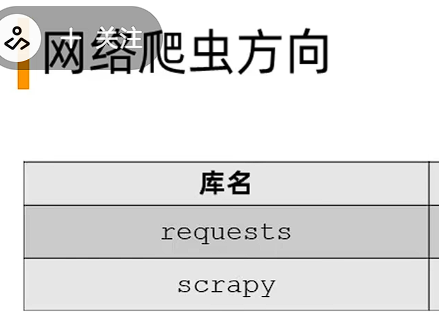{width="2.2868055555555555in"
height="1.6618055555555555in"}2.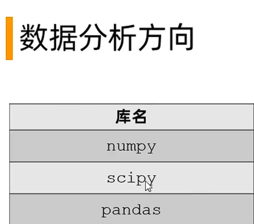{width="2.1930555555555555in"
height="1.9326388888888888in"}

3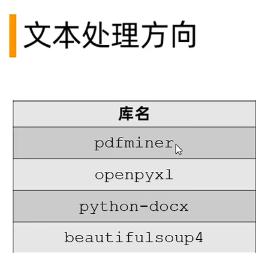{width="2.2243055555555555in"
height="2.1930555555555555in"}4.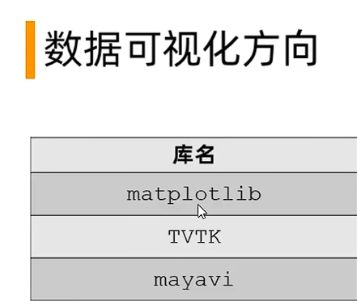{width="2.297222222222222in"
height="1.9638888888888888in"}

5.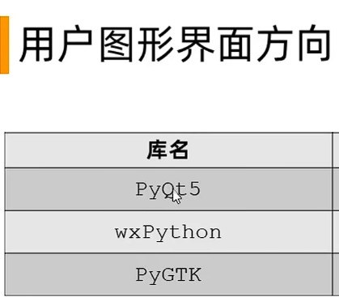{width="2.182638888888889in"
height="1.9118055555555555in"}6.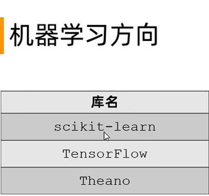{width="2.120138888888889in"
height="1.9951388888888888in"}7.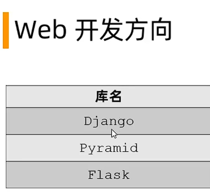{width="2.151388888888889in"
height="1.9638888888888888in"}8.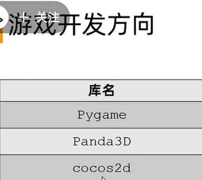{width="2.088888888888889in"
height="1.8597222222222223in"}9.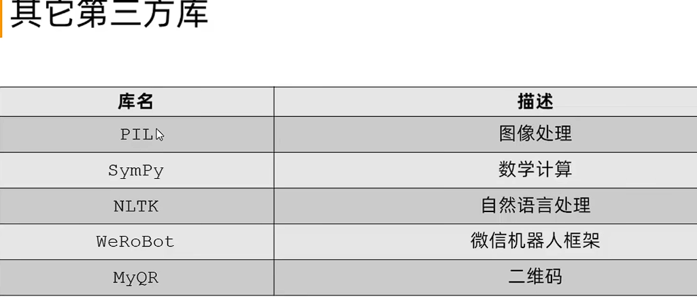{width="5.338888888888889in"
height="2.276388888888889in"}

2.pip库

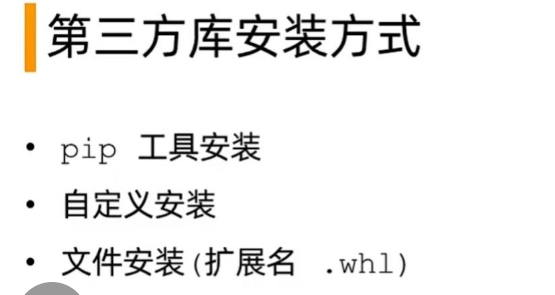{width="2.890972222222222in"
height="1.5368055555555555in"}

在官网上自己按步骤操作

2.1pip库的函数

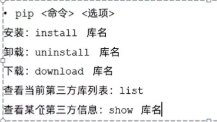{width="1.9222222222222223in"
height="1.0784722222222223in"}

2.2.pip函数的使用？

先呼出cmd，输入pip 命令即可。

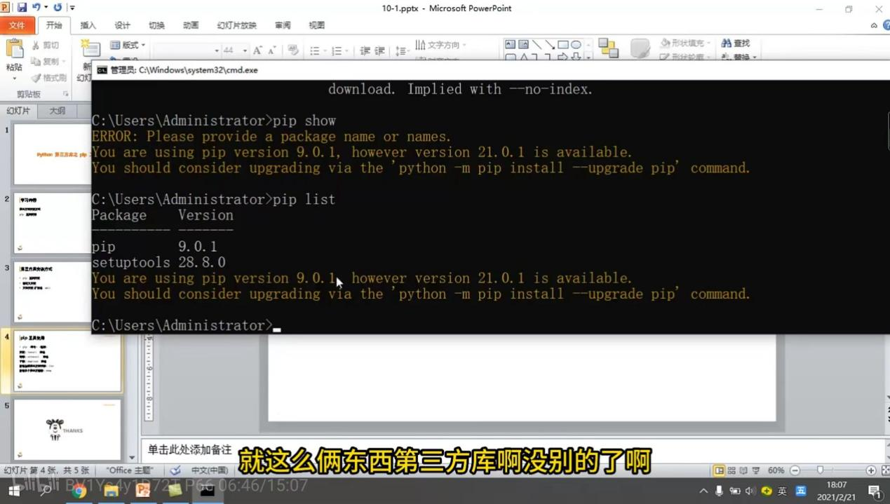{width="5.767361111111111in"
height="3.2680555555555557in"}

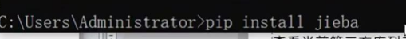{width="2.651388888888889in"
height="0.25555555555555554in"}

下载jieba包

3.jieba

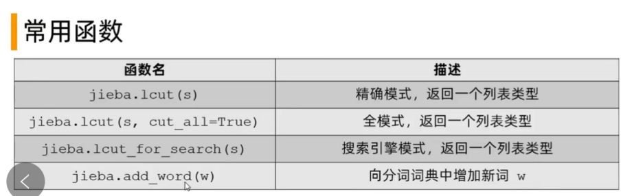{width="4.184027777777778in"
height="1.3006944444444444in"}

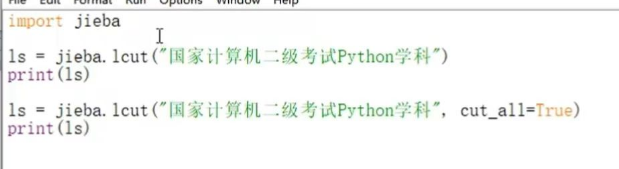{width="3.2243055555555555in"
height="0.8805555555555555in"}

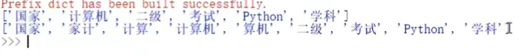{width="3.8493055555555555in"
height="0.41180555555555554in"}

全模式输出的所有的分割可能。

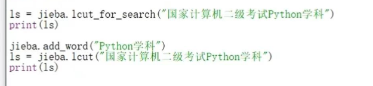{width="3.2555555555555555in"
height="0.7555555555555555in"}

search是寻找大部分可用方式

addword是指我指定添加什么来作为分词。

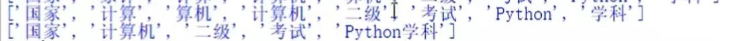{width="3.932638888888889in"
height="0.21388888888888888in"}

二者的输出结果。

# 视频来源

[Bilibili 视频源（BV1Ys4y1D72T）](https://www.bilibili.com/video/BV1Ys4y1D72T/?spm_id_from=333.337.search-card.all.click&vd_source=9d38272dcd8c7d9b75bc1d37c37c8947)

---

For information regarding the source, authorship, and limitations of these notes, please see the [Disclaimer and Source Note](../claim.md).
